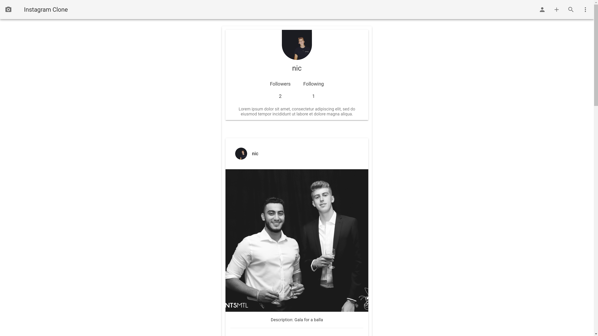

# SOEN 341 project (Instagram)  

**Multiple screenshots can be found below**

## Description

This repo is for our SOEN 341 class, where the objective will be to create a web-app that mimicks *Instagram* and some of its core features. It will be held over 4 **sprints** and we will need to implement core functionalities such as posting pictures, following friends and commenting on posted pictures. We'll then be pitching and implementing additional features that are TBD. Our team will need to document everything on GitHub through the use of **commits**, **issues** and **milestones**.

## Teams members

* Nicolas MacBeth (`Nicolas-MacBeth`)
* Dina Khalesi (`dkhalesi`)
* Jason Botzas-Coluni (`jaybcee`)
* Alexander Shevchenko (`genericalexacc`)
* Laetitia Ségaux (`lsegaux`)
* Paul Farquhar (`paulball`)

## Technology stack

* Go
* Prisma
* MySQL
* Vue.js

## How to run
You need Go, Node and Docker (`docker-machine restart` and VirtualBox VM of Docker running) installed and running.

Then, in your goroot directory:

```console
foo@bar:~$ npm install -g prisma
foo@bar:~$ git clone https://github.com/Nicolas-MacBeth/SOEN341.git
foo@bar:~$ cd SOEN341/goBackend/backend
foo@bar:~$ docker-compose up -d
foo@bar:~$ prisma deploy
foo@bar:~$ go run *.go OR go build and run the executable (i.e ./backend.exe)
```

Open a new console window and run:

```console
foo@bar:~$ cd SOEN341/frontend
foo@bar:~$ npm i
foo@bar:~$ npm run serve
```

The backend will be running at http://localhost:3030/ and the database admin panel can be viewed at http://localhost:4466/_admin.
The frontend can be seen at http://localhost:8080/

## Methodology

`Issues` are to be open for **every** new feature, bug fix or release. They are to be assigned to a `milestone` (4 milestones will be made, one for every sprint). Commit messages are to be **meaningful** (they correctly describe the commit) and **include** "`fixes #xxx`" or "`closes #xxx`" to have them automatically close the related issue (`xxx` should be replaced with the correct issue number). For example, here's a *fake* commit message for issue #54: "*Fixed the bug showing users a weird grey bar, closes #54*". `Branches` are to be named as follows: `<sprint_number>/<type_of_commit>/<short_description>`. For example: `sprint1/feature/readme_update` or `sprint1/bug_fix/grey_bar`. Messages/meetings within the scope of this project should be sent/done over our Slack workspace, in respective channels, and then **documented** in our [wiki](https://github.com/Nicolas-MacBeth/SOEN341/wiki) page. Also, always assign **yourself** to your own PRs when they are created, as well as assign **labels** and the correct **milestone** to it.

## Block Diagram


## Code Style Guide
Golang — Official Go Style Guide  [https://golang.org/doc/effective_go.html](https://golang.org/doc/effective_go.html)
Go uses go-fmt tool to auto format the code.
As long as it's installed, the code is auto formatted for you.


Javascript — ESLint recommended ruleset and Vue specific
[https://eslint.org/docs/rules/](https://eslint.org/docs/rules/),
[https://eslint.vuejs.org/rules/](https://eslint.vuejs.org/rules/)
Eslint is used to enforce this code style in our editor.

## Static Analysis
Static analysis of the backend is carried out via an open source tool called staticcheck that finds further errors and inefficiencies. 
[https://staticcheck.io/](https://staticcheck.io/)

## Screenshots

Here are screenshots of our project, with descriptions.

### Login/signup pages

 

### User's own profile with their posted pictures

 

### Other user's profile and user's home feed when not following said user (Nic is not following Dina)

 

### Other user's profile and user's home feed when following said user (Nic is following Dina)

 

### Comments UI, delete a comment prompt and edit comment prompt

  

### Uploading a new picture to the website. Choosing the picture, caption and filter if wanted

 

### Picture posted on user profile with filter applied


